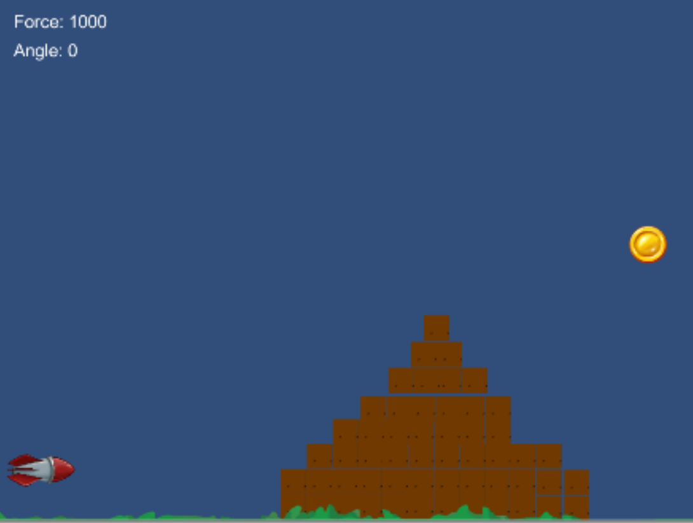

COMP3064 Game Development

Final Test
==========

**Time:** 2h

**Points possible:** 30

This is practical open-book, open-internet test

1.  Setup

    1.  Download ZIP file from the Blackboard

    2.  Rename the folder to ***Final-YourLName*** (1 mark)

    3.  Open the project from the ZIP in Unity and make sure that it
        builds

    4.  You should see the following when you open and play the game

1.  Instructions

    1.  Edit RocketCollider file

        1.  Read rotation from vertical axis into variable called
            rotation (1 mark)

        2.  When rotation &gt;0 rotate up (counter clocwise) (1 mark)

        3.  Limit rotation to 90deg only (1 mark)

        4.  When rotation &lt; 0 rotate down (clockwise) (1 mark)

        5.  Make sure that it rotates no further than to 0deg (flat)
            (1 mark)

        6.  Update the angle lable showing the angle in degrees (be
            careful, because transform.rotation is not showing it
            in degrees) (1 mark)

        7.  Read horizontal axis into variable called forceChange
            (1 mark)

        8.  Update the force:

            1.  if forceChange &gt; 0 add forceStep (1 mark)

            2.  if forceChange &lt; 0 subtract forceStep but only till
                your reach 0 (force cannot be negative) (1 mark)

        9.  Update force label and show the value of the force (1 mark)

        10. Use Fire1 to fire (push) the rocket (1 mark)

            1.  Make sure that you can do it only once (1 mark)

            2.  Change the bodyType of the rigid body tp dynamic
                (1 mark)

            3.  Use AddRelativeForce function to make sure that rocket
                is moving according to the rotation (1 mark)

            4.  Print "***studentID-fire***" to the console (1 mark)

        11. Handle collisions. if you collide with a stone do the
            following: (1 mark)

            1.  Destroy the stone that you have collided with (1 mark)

            2.  Move rocket to predefined spawn point (launching point)
                (1 mark)

            3.  Make sure that it does not fall down (is kinematic)
                (1 mark)

            4.  Set the velocity and angular velocity of the rocket to 0
                (1 mark)

            5.  Reset flags to allow the player to fire again (1 mark)

            6.  Play the explosion animation (you can create one of use
                the prefab) in the location of the stone (1 mark)

        12. Add a killzone to the scene and tag it accordingly (1 mark)

        13. If you collide with the killzone

            1.  Move rocket to predefined spawn point (launching point)
                (1 mark)

            2.  Make sure that it does not fall down (is kinematic)
                (1 mark)

            3.  Set the velocity and angular velocity of the rocket to 0
                (1 mark)

            4.  Reset flags to alow the player to fire again (1 mark)

        14. If you collide with the target

            1.  Make a transition to the game over/you won screen
                (1 mark)

    2.  Edit ButtonScript

        1.  Add a function that will allow us to restart the game and go
            back to the main scene (1 mark)

    3.  Make sure that the Reset button executes the function added to
        the ButtonScript and makes the transition (1 mark)

2.  Submission

    1.  Save all files and scenes

    2.  Submit the whole folder that you have renamed in a setup as a
        **ZIP file** on blackboard

    3.  Make sure that submitted file contains all things that you
        wanted to submit by downloading it and opening the project.

